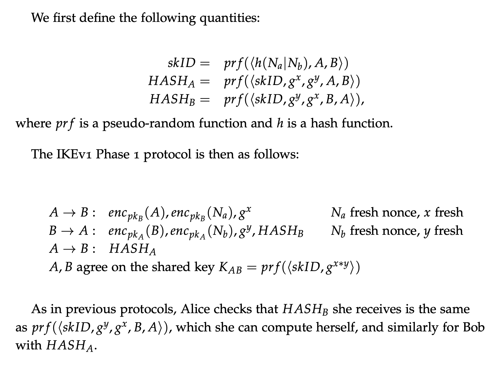
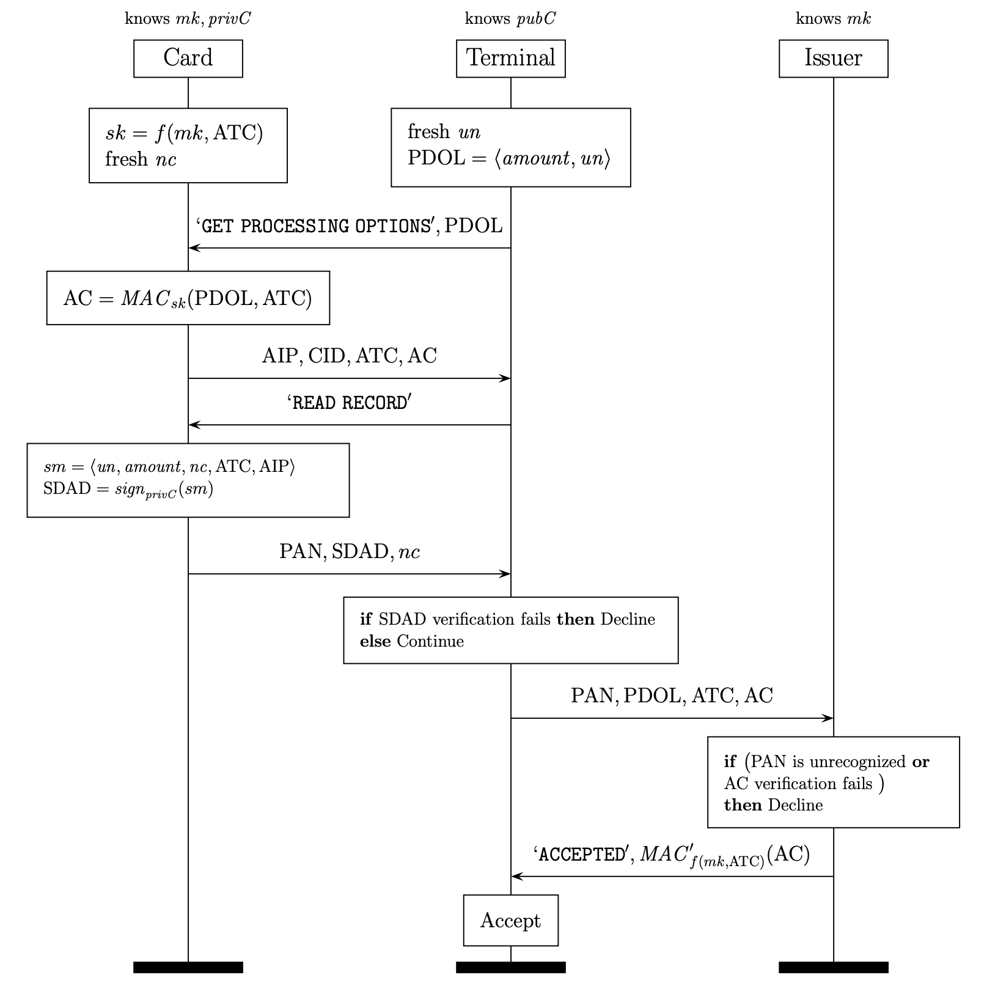

# Visa Contactless Protocol and IKEv1 Key Exchange in Tamarin Prover

My solution to 4th module of Information Security Lab Autumn Semester in ETH Zurich. I implemented
Encrypted Diffie-Hellman Key Exchange, IKEv1 and a simplified version of Visa Contactless Protocol
in Tamarin Prover.

## Lab 1 | Key Exchange

This lab is focused on modelling and analysing one of the IKEv1 (Internet Key Exchange) key exchange protocols. These protocols are based on the Diffie-Hellman key exchange, and are used to set up secure, authenticated channels in the IPsec protocol suite.

In this lab, I start by modelling the basic unsigned Diffie-Hellman protocol in Tamarin. I then progressively strengthen it, to obtain protocols that provide stronger security guarantees which I prove using Tamarin. In the end, I reach one of the IKEv1 protocols, and show that it provides forward secrecy of the shared key.

The protocol figure:

Detailed task description and foundations are in the file **tamarin-lab1.pdf**.

Tamarin files related to this lab are **EncryptedDH.spthy, EncryptedDH2.spthy, IKEv1.spthy**.

## Lab 2 | Simplified EMV Protocol

EMV, founded by companies Europay, Mastercard, and Visa (thus the name) is the international protocol standard for in-store smartcard payments. In this lab I develop a Tamarin security model and use it to perform a formal analysis of a simplified version of the EMV protocol for Visa contactless transactions.

The goal of this lab is to deepen modeling and analysis skills, with the use case of a real-world protocol that is used in over 2 billion payment cards and 40 million payment terminals worldwide. Specifically, learning how to model cryptographic mechanisms involving both asymmetric and symmetric crypto, communication channels with different levels of security, multiple roles, and branching execution (similar to if statements in imperative languages).

The protocol figure:

Detailed task description and foundations are in the file **tamarin-lab2.pdf**.

Tamarin file related to this lab is **Visa.spthy**.
